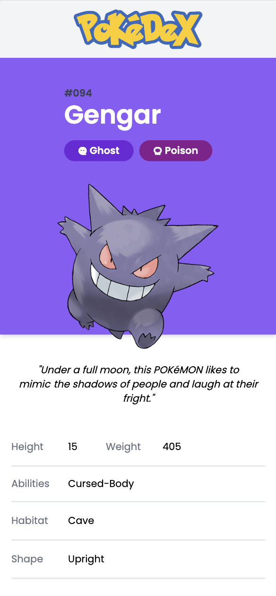
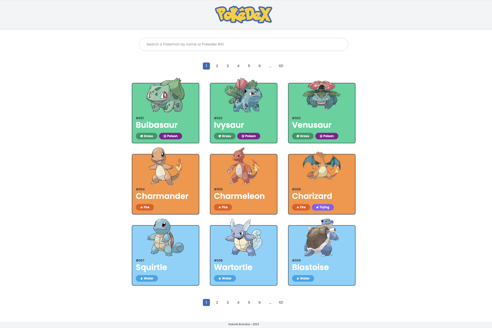

# Pokedex App

Welcome to the Pokedex App! This is a web application that allows you to browse and discover all the different Pokemon species and their details.

---

## Snapshots




---

## Prerequisites

Before you can install and run this application, make sure you have the following dependencies installed:

- Node.js
- npm
- git

---

## Installation

1. Clone this repository onto your local machine:

```js
git clone https://github.com/Branda0/pokedex.git
```

2. Navigate to the root directory

```js
cd pokedex
```

3. From their you need to install the front and back dependencies and run them

   #### For the backend & from the root directory

   ```js
   // Install
   cd pokedex-nestjs
   npm install

   // Run
   npm run start
   ```

   #### For the frontend & from the root directory

   ```js
   // Install
   cd pokedex-react
   npm install

   // Run
   npm run dev

   ```

4. You should now have your two servers running

   Front should be running on : http://127.0.0.1:5173/

   Back should be running on : http://127.0.0.1:3333/

---

## Dependencies

The Pokedex App uses the following dependencies:

### Frontend

- axios: ^1.2.2
- dotenv: ^16.0.3
- react: ^18.2.0
- react-dom: ^18.2.0
- react-query: ^3.39.2
- react-router-dom: ^6.6.1

### Backend

- @nestjs/axios: ^1.0.1
- @nestjs/common: ^9.2.1
- @nestjs/core: ^9.0.0
- @nestjs/cqrs: ^9.0.1
- @nestjs/platform-express: ^9.0.0
- axios: ^1.2.2
- class-transformer: ^0.5.1
- class-validator: ^0.14.0
- reflect-metadata: ^0.1.13
- rxjs: ^7.2.0
