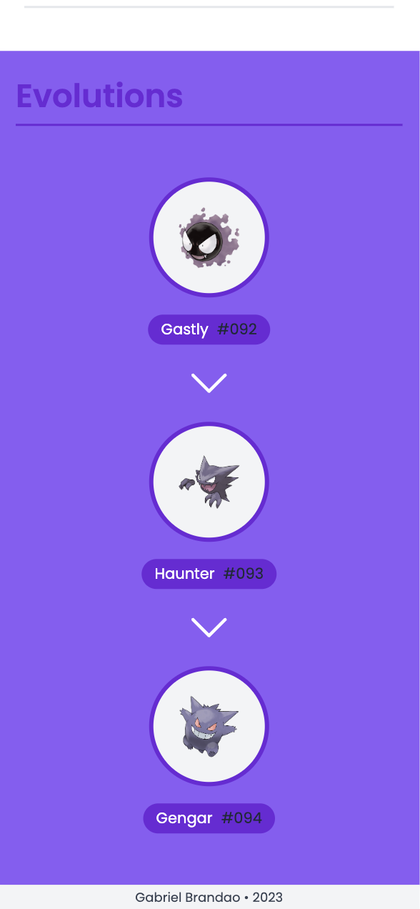

# Pokedex App

**Welcome to the Pokedex App! This is a web application that allows you to browse and discover all the different Pokemon**

---

## Description

The app consists of :

- a NestJS backend that consumes the [PokéAPI](https://pokeapi.co/docs/v2)
- a ReactJS front that displays and perform the caching of fetched data utilizing the react Query library

---

## Stack


---

## Demo

You can use the Pokedex online from [there](https://pokedex-branda0.netlify.app/)

[](https://app.netlify.com/sites/pokedex-branda0/deploys)

---

## Snapshots


&nbsp;&nbsp;&nbsp;&nbsp;&nbsp;&nbsp;&nbsp;&nbsp;&nbsp;&nbsp;


---

## Prerequisites

Before you can install and run this application, make sure you have the following dependencies installed:

- Node.js
- npm
- git

---

## Installation

1. Clone this repository onto your local machine:

```js
git clone https://github.com/Branda0/pokedex.git
```

2. Navigate to the root directory

```js
cd pokedex
```

3. From their you need to install the front and back dependencies and run them

   #### For the backend & from the root directory

   ```js
   // Install
   cd pokedex-nestjs
   npm install

   // Run
   npm run start
   ```

   #### For the frontend & from the root directory

   ```js
   // Install
   cd pokedex-react
   npm install

   // Run
   npm run dev

   ```

4. You now have two servers running

   Front should be running on : http://localhost:5173/

   Back should be running on : http://localhost:3333/

---

## Dependencies

The Pokedex App uses the following dependencies:

### Frontend

<details>
<summary>Dependencies</summary>

      - axios: ^1.2.2
      - dotenv: ^16.0.3
      - react: ^18.2.0
      - react-dom: ^18.2.0
      - react-query: ^3.39.2
      - react-router-dom: ^6.6.1

</details>

<details>
<summary>devDependencies</summary>

      - @types/node: ^18.11.18
      - @types/react: ^18.0.26
      - @types/react-dom: ^18.0.9
      - @vitejs/plugin-react: ^3.0.0
      - postcss": ^8.4.20
      - autoprefixer": ^10.4.13
      - tailwindcss": ^3.2.4
      - typescript": ^4.9.3
      - vite: ^4.0.0

</details>
<br>

### Backend

<details>
<summary>Dependencies</summary>

      - @nestjs/axios: ^1.0.1
      - @nestjs/common: ^9.2.1
      - @nestjs/core: ^9.0.0
      - @nestjs/cqrs: ^9.0.1
      - @nestjs/platform-express: ^9.0.0
      - axios: ^1.2.2
      - class-transformer: ^0.5.1
      - class-validator: ^0.14.0
      - reflect-metadata: ^0.1.13
      - rxjs: ^7.2.0

  </details>

<details>
<summary>devDependencies</summary>

      - @nestjs/cli: ^9.0.0
      - @nestjs/schematics: ^9.0.0
      - @nestjs/testing: ^9.0.0
      - @types/express: ^4.17.13
      - @types/jest: 29.2.4
      - @types/node": 18.11.18
      - @types/supertest": ^2.0.11
      - @typescript-eslint/eslint-plugin: ^5.0.0
      - @typescript-eslint/parser: ^5.0.0
      - eslint: ^8.0.1
      - eslint-config-prettier: ^8.3.0
      - eslint-plugin-prettier: ^4.0.0
      - jest: 29.3.1
      - prettier: ^2.3.2
      - source-map-support: ^0.5.20
      - supertest: ^6.1.3
      - ts-jest: 29.0.3
      - ts-loader: ^9.2.3
      - ts-node: ^10.0.0
      - tsconfig-paths: 4.1.1
      - typescript: ^4.7.4

</details>
<br>

---

## Mediflash

### Question

Si 5 devs rejoignent ton équipe demain et que ton application est en production, quelles sont les améliorations à apporter à l'environnement de Dev et pourquoi ?
Les classer par ordre de priorité

### Réponse

- Si 5 devs rejoignent mon équipe, la première problématique sera de faire en sorte que la collaboration entre nous soit la plus optimale, mettre en place un système de versioning sera donc je pense la priorité pour éviter la collision entre nos différents codes et faciliter le déploiement de nouvelles fonctionnalités.

- En agrandissant l’équipe, garder le contrôle sur la qualité du code sera aussi un des challenge premier, ainsi en plus de tests unitaires il est primordial de s’assurer que le code passé en production est « validé » et ainsi mettre en place un processus d’intégration continue sera ma seconde mesure.

- En grandissant, l’application se doit aussi de continuer d’être performante, il faut ainsi s’assurer de la scalabilité de notre architecture et pour cela mettre en place un système de monitoring sera ma troisième mesure.

- Afin de rendre l’ensemble du code plus compréhensible pour l’ensemble des devs mais aussi de faciliter sa maintenance, mettre en place un système de documentation.

- Pour finir il me semble important de maintenir une certaine culture d’entreprise, favoriser les échanges entre les différents membres et mettre en place des sessions de peer review et de pair programming.
